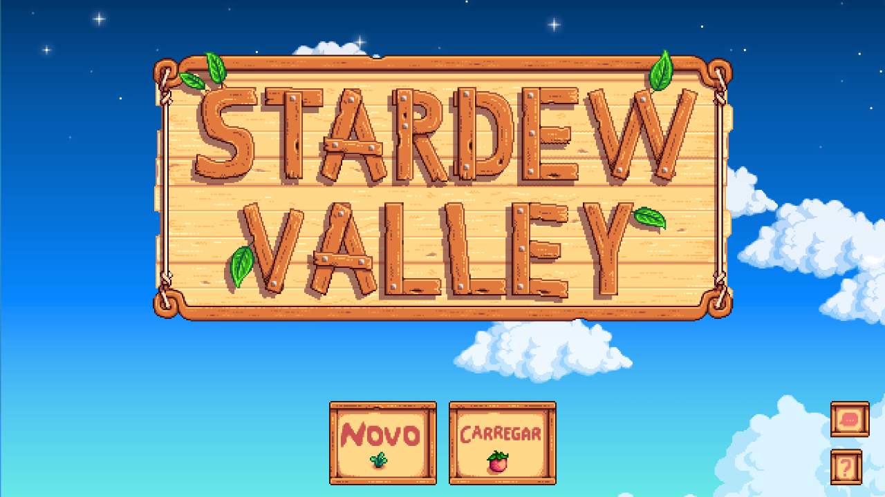
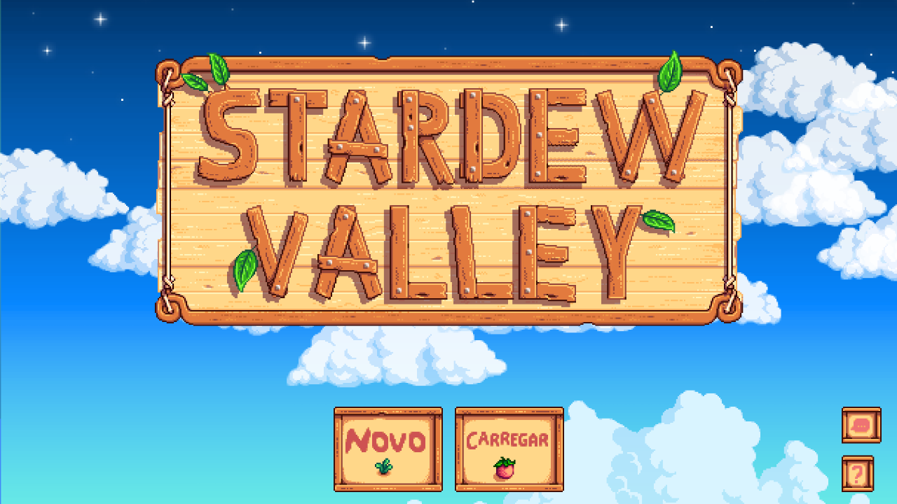
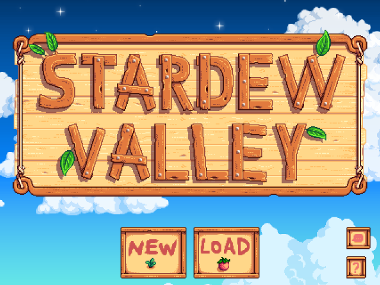
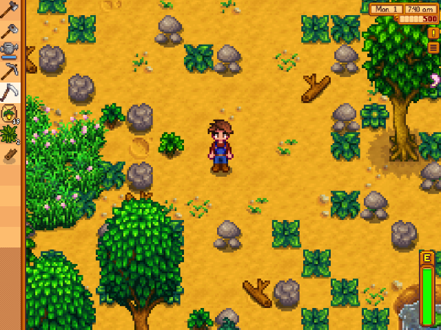
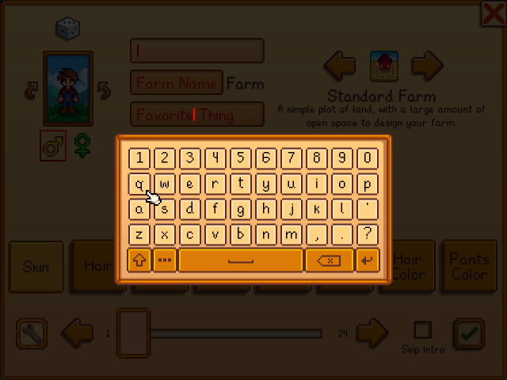
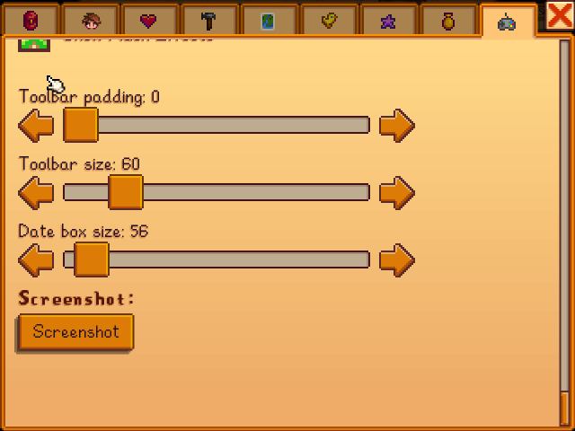

# Stardew Valley — native AArch64 multi-device port

**Language / Idioma:** [English](#english) · [Português](#português)

A native Linux port of the **Android** release of Stardew Valley
(`com.chucklefish.stardewvalley` 1.6.15.3, arm64-v8a), running on low-power retro
handhelds — **no Android, no emulator, no container**. Our own ELF loader boots the
entire **Mono-Android / .NET 8 runtime** on glibc and drives the game from there.

It is a **BYO-data** project: not a single byte of game content — no APK, no assets,
no `libmonosgen`, no assembly store — is in this repository or in the released ZIP.
You supply your own legal copy.

## Download

Grab **`Stardew.Valley.NextOS.zip`** from the
[latest release](https://github.com/NextOs-Ports/stardewvalley-nextos/releases/latest)
and extract it into your device's ROM root (`/roms` on ArkOS/ROCKNIX/muOS/Knulli/batocera,
`/storage/roms` on EmuELEC/NextOS). Put your own arm64-v8a Android package in
`ports/sdvnextos/gamedata/` and launch it from the Ports menu. **NXExtract 1.1.2**
validates and prepares the data transactionally on the first run (~420 MB, a few
minutes). APK, APKM, APKS, XAPK and bundle ZIP inputs are accepted.

**Exit the game: SELECT + START.**

## v1.1.3 — standard thin PortMaster launcher

- The visible entries in `ports/` and `ports_scripts/` are now identical 21-line POSIX
  wrappers instead of two copies of the complete 325-line launcher.
- All tested behavior lives once in `ports/sdvnextos/run.sh`: PortMaster integration,
  single-instance lock, NXExtract, firmware/build selection, logging, foreground launch
  and cleanup.
- Both entry layouts resolve the same runtime relative to the ROM root and preserve
  arguments, signals and exit status. Installing over v1.1.2 does not re-extract data or
  touch saves.

**Em português:** os arquivos que aparecem no menu agora seguem o formato enxuto do
PortMaster. Toda a lógica multi-device continua intacta em um único `sdvnextos/run.sh`,
sem duplicação e sem mexer nos dados ou saves.

## v1.1.2 — RG-DS / ROCKNIX black-screen recovery

- The complete reporter logs prove that the 394 MiB NXExtract transaction finished
  successfully. On AArch64, its visual child now resolves the firmware SDL/Wayland
  libraries first, following the physically working Horizon Chase setup path. Only new
  NXExtract UI diagnostics from the current run are copied into `debug.log`.
- The persistent game black screen had a separate, exact cause. Mesa accepts
  `eglBindAPI(EGL_OPENGL_API)` even when SDL's current context is OpenGL ES 3.1.
  MonoGame consequently classified GLES as desktop GL, failed its framebuffer capability
  check and threw before the first frame.
- The loader now hides only the leaked `dlsym(NULL, "eglBindAPI")` probe from the missing
  desktop-GL library. MonoGame's own supported fallback selects GLES and resolves the
  core framebuffer entry points through `libGLESv2`/SDL. It does not fake an extension,
  unblock desktop GL or force a video backend.
- Host policy tests and a real Mesa probe cover the regression: Mesa exposed no legacy
  `GL_EXT_framebuffer_object` string, while its core FBO entry points produced a complete
  framebuffer. RG-DS hardware confirmation of the release build is still pending.

**Em português:** o log completo mostrou que a extração terminava corretamente, mas a
interface podia ficar invisível; por isso o filho visual agora prioriza as bibliotecas do
firmware. A tela preta persistente vinha depois: o Mesa aceitava o probe de OpenGL desktop
e o MonoGame classificava errado o contexto GLES 3.1, abortando antes do primeiro frame.
A v1.1.2 bloqueia somente esse probe vazado e deixa o fallback GLES nativo do MonoGame
seguir. Não há extensão FBO falsa, backend de vídeo forçado nem mudança nos saves.

## v1.1.1 — new-farm zoom, arrow cursor and ROCKNIX setup

- A brand-new farm now starts at the game's supported 0.75 zoom default. Existing
  saves keep their own serialized zoom preference byte for byte.
- The right-stick crosshair is now a crisp Stardew-coloured pixel-art arrow. Its
  top-left tip remains the exact R3 touch hotspot.
- The NXExtract hook now ships its own audited AArch64 LZ4 runtime (GLIBC 2.17), fixing
  the 65% `prepare-managed-runtime` failure on ROCKNIX systems without `liblz4.so`.
- Original data and every earlier public assembly patch migrate to the same verified
  result; failed or interrupted setup remains resumable and never touches saves.

**Em português:** fazendas novas agora começam no zoom 0,75 sem mudar a preferência de
saves antigos; o cursor virou uma seta pixel-art; e o preparador leva seu próprio LZ4
AArch64, eliminando a dependência que faltava no ROCKNIX. A atualização reaproveita os
dados já extraídos e preserva os saves.

## v1.1.0 — controller and universal-device release

- Character fields now always open the game's internal keyboard. Clicking a fresh
  field clears only its red placeholder; a real name is never erased.
- The final Options tab scrolls natively with D-pad navigation, all the way
  through Snow Transparency, toolbar settings and Screenshot. The right-stick cursor
  remains available everywhere.
- NXExtract installs, validates, updates and adopts existing 1.6.15.3 data safely. It
  also migrates the earlier public assembly-store patch without touching saves.
- Video and audio now prefer each firmware's own SDL/EGL/GLES/OpenAL stack and negotiate
  resolution, graphics context and sound backend instead of forcing one device profile.
- Two audited loaders are included: the current NextOS sysroot build (glibc 2.43) and an
  external-CFW compatibility build (current artifact max GLIBC 2.17).

**Em português:** esta release corrige o teclado dos três campos de personagem (a dica
vermelha some ao clicar, sem apagar nomes reais), adiciona rolagem nativa por controle na
última aba das Opções, integra o NXExtract 1.1.2 com migração segura do v1.0 e negocia
vídeo/áudio com as bibliotecas de cada firmware. Tudo foi retestado em gameplay real no
ArkOS, incluindo áudio, save preservado e retorno ao jogo depois do fim das Opções.

## Screenshots

Real framebuffer captures off real hardware — no upscaling, no mock-ups:

| | |
|---|---|
|  |  |
|  |  |
|  |  |

Top row: NextOS Elite handheld (Amlogic, **Mali-450**, GLES2 only, ~1 GB RAM) at
1280×720 — the animated day/night sky of the title screen, in the game's own
Portuguese localisation. Remaining rows: **R36S / ArkOS** (RK3326, Mali-G31, KMSDRM)
at 640×480, showing title, farm gameplay and the two controller fixes from v1.1.0.

---

## Community

Questions, bug reports, help getting the port running, and news about the next ones:

💬 **Discord:** [discord.gg/DHfY62eDNN](https://discord.gg/DHfY62eDNN)

## English

### Status

**Playable end to end**, with real saves, on the validated devices below. The RG-DS
fix in v1.1.2 was built from the community trace and the already-proven Horizon Chase
and TASM2 ROCKNIX paths; a post-release hardware confirmation is still requested.

| Device | Video | State |
|---|---|---|
| Mali-450 / Amlogic-old (EmuELEC, fbdev) | ES2 on fbdev, 1280×720 | playable, real save — the bench this port was born on |
| R36S / ArkOS (RK3326, Mali-G31) | ES2 over an ES3 context, KMSDRM, 640×480 | playable, real save, controller/audio/video validated on 2026-08-01 |
| RG 40XX-H / muOS | firmware SDL/EGL/GLES | community-confirmed working beautifully with v1.1.1 |
| RG-DS / ROCKNIX (Panfrost, Wayland, Mesa 26.1.2) | GLES 3.1/core FBO | v1.1.1 trace aborts before frame 1; v1.1.2 classification fix shipped, awaiting reporter retest |
| Other AArch64 | negotiated at runtime | compatible route, not individually hardware-tested here |

Character creation, the game's own controller keyboard, native Options scrolling, real
saves, gameplay, OpenAL audio and VSync were exercised on hardware. A complete ArkOS
session covered first-run setup, title menus, a loaded farm, the full Options list and
return to gameplay without changing the existing saves. The shipped
`stardewvalley.multi` is built in Debian Buster (current artifact max GLIBC 2.17), so it
covers old and current external CFWs; NextOS uses its own current-sysroot loader.

> The famous "fundamental allocator wall" (Mono asserting `lock-free-alloc.c:608`)
> turned out **not** to be a wall at all: Bionic and glibc number their `sysconf`
> constants differently (`_SC_PAGESIZE` = 39 on Bionic ≠ glibc), so Mono was told a
> garbage page size. Mapping the `_SC_*` constants fixed the "unfixable".

### How it works (architecture)

There is no Android, no Java and no Activity system — we fake all three:

1. Our ELF loader (`so_util`) loads the Bionic chain `libmonosgen-2.0.so` →
   `libxamarin-app.so` → `libmonodroid.so`, snapshotting exported symbols between
   stages.
2. A fake `JavaVM`/`JNIEnv` (flat vtable at the exact Bionic arm64 LP64 offsets) is
   handed to `JNI_OnLoad`, then `Java_mono_android_Runtime_init` runs the **complete**
   .NET-for-Android bootstrap (MonoVM 9.0.8.0) and returns cleanly.
3. Mono components and AOT images are loaded through the so-loader's own
   `dlopen`/`dlsym` (glibc `dlopen` dies on their lazy-PLT/IRELATIVE relocs);
   `libaot-*.dll.so` is deliberately refused so Mono falls back to JIT.
4. With the runtime up, we drive the `MainActivity` lifecycle by hand (`onCreate` →
   managed `OnCreate` → `Game.Run()`), and `MonoGameAndroidGameView` runs the managed
   game loop.
5. SDL2 owns the real ES2 context; the fake EGL10 surface just presents it to MonoGame.
   The backbuffer is forced opaque (alpha = 1) for the Amlogic fbdev compositor.
6. Audio: XACT/OpenAL — MonoGame's `libopenal32.so` is redirected to the system
   `libopenal.so.1`.

Nothing about the device is hardcoded: paths come from `/proc/self/exe`, and
resolution, GLES version, backbuffer format and audio backend are all negotiated at
runtime.

### Walls we broke

| Wall | Cause | Fix |
|---|---|---|
| Mono allocator assertion (`lock-free-alloc.c:608`, sgen pagesize) | `sysconf` `_SC_*` numbering differs Bionic ≠ glibc → `mono_pagesize` garbage | map Bionic `_SC_{39,40,96–99}` to real values |
| SIGBUS on Mono's global semaphore | `sem_t` is 16 B on Bionic vs 32 B on glibc | own `sem_*` implementation on futex |
| "No JavaVM registered with handle 0x0" (managed) | `GetJavaVM` missing from the fake vtable (slot 0x6D8) | implement it, return the fake VM |
| managed saw a pending exception after EVERY `FindClass` | `ExceptionOccurred`/`ExceptionCheck` sat at WRONG vtable offsets; the real slots hit the non-NULL default → the `Java.Lang.Throwable` typemap error was a **symptom** | move to the real offsets (idx 15 / idx 228) + `Push/PopLocalFrame` |
| SIGSEGV in `Memmove` reading any string | `Java.Interop` uses the UTF-16 path (`GetStringChars`), slots missing → default sentinel dereferenced | implement UTF-16 slots (`0x520/0x528/0x530`) |
| "JNIEnv::RegisterNatives() returned 2" | shim was `void` → managed read garbage from `x0` | return `int` 0 (JNI_OK) |
| ~520 MB RAM spike per music track | 258 MB `music.xwb` copied whole into a `MemoryStream` | fake asset stream exposes only the XACT metadata and turns the skip into a native `fseek` |
| `SetRenderTarget` silently ignored (no FBOs) | fake `Looper.myLooper()` made `SyncContext.Send` run on the background task | promote the worker to foreground in `myLooper` — UI-thread semantics restored |
| Mali corrupted after ~1500 frames | temporary GL trace wrappers | production dispatch returns the context entrypoints directly (14k+ frames stable) |
| no keyboard on `TextBox` fields | `ShowAndroidKeyboard` expects the Android IME | patched to open the game's own `TextEntryMenu` |
| red placeholder corrupts a new name | Android normally replaces the hint, but the Linux path treated it as real text | clear only when `Text == TitleText`, then preserve all user-entered text |
| final Options tab only scrolls with a cursor | Android gamepad buttons reached the page but had no native scroll action | route D-pad Up/Down to the page's own bounded scroll method; retain the original behavior for every other menu/button |
| save stuck / simulated "disk full" | offline network barrier + `Java.IO.File.get_UsableSpace` returning 0 | confirm the barrier, return the real `statvfs` |
| flicker/tearing | swap interval set before the context existed | `SDL_GL_SetSwapInterval(1)` once the context is current |
| game closed at "Saving…" on other devices | `getFilesDir` hardcoded to one device path | everything derives from `/proc/self/exe` (`$HOME` is no anchor — Mono rewrites it in `Runtime_init`) |
| phone-sized zoom (~13 tiles) | the fake `DisplayMetrics` reported a fixed 160 dpi | `MobileDisplay`'s real curve measured on hardware; dpi computed to pin the framing in tiles (`SDV_TILES_X`, default 15) |
| a new farm looked closer than an existing save | Android stores the player's zoom per save, while a fresh `Options` object started at 1.0 | set only the new/default single-player value to the supported 0.75 minimum; loaded saves still overwrite it with their stored value |
| ROCKNIX setup failed at 65% | the managed-store hook assumed the optional system `liblz4.so` existed | bundle an audited AArch64 LZ4 runtime requiring only GLIBC 2.17 and load it before any system fallback |
| RG-DS stayed black during/after first setup | NXExtract's UI could inherit a compatibility SDL; afterward Mesa's global `eglBindAPI` made MonoGame misclassify the real GLES 3.1 context as desktop GL and reject core FBO support | isolate only the NXExtract child to firmware-first AArch64 libraries; hide the invalid null-handle desktop probe so MonoGame takes its native GLES path |

### Controls

- Movement/menus: D-pad and left stick through the native Android/MonoGame path.
- In long menus such as the final Options tab, D-pad navigation scrolls the
  page natively and respects its top and bottom limits.
- A/B/X/Y, L1/R1/L2/R2, Start and Select follow the SDL GameController mapping.
- **Right stick**: independent native pixel-art arrow cursor (radial deadzone + acceleration,
  auto-hides after 2 s). Does not steal the game's native focus.
- **R3**: sends a real Android touch at the arrow tip while the cursor is visible; acts as a normal
  native button while it is hidden.
- **SELECT+START**: immediate exit inside the binary (`_exit(0)`) — no Mono/GL shutdown
  hangs.

### Getting the game data — **required**

This repository ships only our loader **code**, never ConcernedApe's binaries or assets.
You must own the game and supply the legit APK:

| package | version | ABI |
|---|---|---|
| `com.chucklefish.stardewvalley` | **1.6.15.3** | arm64-v8a (32-bit will not do) |

Put the package inside `ports/sdvnextos/gamedata/` and launch. NXExtract 1.1.2 accepts
APK, APKM, APKS, XAPK and bundle ZIP files, resolves the arm64 split when necessary,
validates the exact package payload and then commits `libs/` and `assets/` as one
recoverable transaction. On later launches its marker and checkpoints provide a fast
path; you may remove the source package after setup succeeds. The outer filename and
APK/XAPK SHA may differ between legitimate stores and split containers: acceptance is
based on the exact inner package, ABI and payload. A genuinely different game assembly
is accepted only after its hash and patch layout have been audited.

The assembly store `libassemblies.arm64-v8a.blob.so` receives small local patches
(controller keyboard, placeholder handling, native Options scrolling, new-farm zoom and
the offline save barrier) — `tools/prepare_stardew_data.py` applies and verifies them on
*your* copy. Existing v1.0 and v1.1.0 data is migrated in place before NXExtract adopts
it. Assets and saves are never part of Git or the public ZIP.

### Troubleshooting

Every session writes `sdvnextos/debug.log` (previous run in `debug.prev.log`). The line
that matters after data setup is:

```
[sdv-egl] ready 640x480 driver=wayland ES2 a8 d24 s8 GL='OpenGL ES 3.2 …'
```

**Black screen during the first setup** → do not power off while `debug.log` still shows
`extracted ...`; that is NXExtract, not the game. Wait for `=== installation complete ===`.
v1.1.2 also appends the last NXExtract UI diagnostics to the same log.
**Black screen after installation** → check that the log reaches `[sdv-egl] ready` and
that `GL=` contains `OpenGL ES`. In v1.1.1, the RG-DS trace then ended with
`MonoGame requires either ARB_framebuffer_object or EXT_framebuffer_object`; this was an
API-classification bug, not missing hardware support. v1.1.2 logs that the leaked global
`eglBindAPI` probe was hidden and should continue through `surface 2 created` to
`swap #1`.
**No sound** → the game plays through OpenAL; backend order lives in `alsoft.conf`
(`pipewire`, `pulse`, `alsa`). Force one with `AUDIO_DRIVER=alsa` or `AUDIO_DRIVER=pulse`.
**NXExtract stopped at 65% on an older package** → install v1.1.3 or newer over it and
launch again. The validated stage is resumed and the bundled LZ4 runtime completes the
hook.
**Camera too close/far** → `SDV_TILES_X=15` controls the framing (screen width in tiles).

For a one-shot developer capture of the actual GPU backbuffer, create
`/dev/shm/sdv-shot` while the game is running. Within a few presents the port writes
`/dev/shm/sdv-shot.ppm` and consumes the trigger. This works even when `/dev/fb0` is not
the active KMS scanout.

All knobs are environment variables, off by default; the full list is in
[`INSTALAR.md`](INSTALAR.md) (Portuguese).

### What is in this repository

- `src/` — the ELF loader, Bionic→glibc shims, fake JNI/JavaVM, EGL/GLES bridge, fake
  asset manager and input.
- `arkos/` — the thin PortMaster/EmuELEC entry wrapper and `alsoft.conf`.
- `run.sh` — the single internal multi-device runtime used by both launcher locations.
- `nxextract.py`, `nxextract-ui`, `extractor.json` and `run-extractor.sh` — NXExtract
  1.1.2 plus this game's exact transactional recipe.
- `package/` — the deterministic release ZIP builder, allowlist and public-data audit.
- `tools/prepare_stardew_data.py` — portable Python 3.7+ assembly-store migration used
  on the device; `tools/PatchStardewOsk.cs` is its Cecil-based developer counterpart.
- `tools/liblz4.so.1`, `LZ4-PROVENANCE.md` and `licenses/` — audited GLIBC 2.17
  AArch64 setup dependency and its redistribution terms; no firmware package required.
- `.build-provenance/` and `tools/build_provenance.py` — reproducible source/toolchain
  records checked before packaging.
- `HANDOFF.md` — the full engineering log of the Mono/Xamarin bootstrap and every wall
  (required reading before touching the port).
- `stardewvalley` — loader built against the current NextOS sysroot (glibc 2.43).
- `stardewvalley.multi` — explicit external-CFW loader built in Debian Buster (current
  artifact and enforced ceiling: GLIBC 2.17).

### Build

```bash
bash ./build.sh                    # current NextOS sysroot -> stardewvalley

SR=<current NextOS aarch64 sysroot>
docker run --rm -v "$PWD":/repo -v "$SR":/nxsr:ro \
  gtactw-arm64-builder:debian-buster bash /repo/build_buster.sh
                                    # external CFW -> stardewvalley.multi

./package/build-package.sh         # audited deterministic BYO-data ZIP
```

Both build scripts write provenance records. Packaging verifies their source digest,
compiler/sysroot identity, AArch64 architecture and GLIBC bounds before creating the
ZIP.

### Licences

The port code in this repository is © NextOS and distributed under the
**GNU GPL-3.0** (see [`LICENSE`](LICENSE)) — anyone may use, study, modify and
redistribute it under the same terms. The bundled LZ4 runtime is redistributed under
the BSD 2-Clause licence in `licenses/LZ4-BSD-2-Clause.txt`. Stardew Valley, its engine
assemblies and every asset remain the property of ConcernedApe / Chucklefish and are
supplied only by the user, from their own legal copy.

### Support this work

- 💗 **GitHub Sponsors**: [github.com/sponsors/NextOs-Ports](https://github.com/sponsors/NextOs-Ports)
- ☕ **Ko-fi**: [ko-fi.com/nextos](https://ko-fi.com/nextos)
- 🇧🇷 **PIX**: [livepix.gg/nextos](https://livepix.gg/nextos)

---

## Português

### Estado

**Jogável do início ao fim**, com save real, nos aparelhos validados abaixo. A correção
RG-DS da v1.1.2 foi construída a partir do log comunitário e dos caminhos ROCKNIX já
aprovados do Horizon Chase e TASM2; ainda aguardamos o reteste físico pós-release.

| Aparelho | Vídeo | Estado |
|---|---|---|
| Mali-450 / Amlogic-old (EmuELEC, fbdev) | ES2 em fbdev, 1280×720 | jogável, save real — é a bancada onde o port nasceu |
| R36S / ArkOS (RK3326, Mali-G31) | ES2 sobre contexto ES3, KMSDRM, 640×480 | jogável, save real, controles/áudio/vídeo validados em 01/08/2026 |
| RG 40XX-H / muOS | SDL/EGL/GLES do firmware | comunidade confirmou funcionamento excelente na v1.1.1 |
| RG-DS / ROCKNIX (Panfrost, Wayland, Mesa 26.1.2) | GLES 3.1/FBO core | log da v1.1.1 aborta antes do frame 1; correção de classificação v1.1.2 publicada, aguardando reteste |
| Outros AArch64 | negociado em runtime | rota compatível, sem teste físico individual aqui |

Criação de personagem, teclado do próprio jogo controlado pelo joystick, rolagem nativa
das Opções, saves reais, gameplay, áudio OpenAL e VSync foram exercitados no aparelho.
Uma sessão completa no ArkOS passou por preparação inicial, menus, fazenda carregada,
fim da lista de Opções e volta ao gameplay sem alterar os saves existentes. O
`stardewvalley.multi` é compilado em Debian Buster (artefato atual: GLIBC máx. 2.17),
cobrindo CFWs externos antigos e atuais; no NextOS entra o loader do sysroot atual.

> O famoso "muro fundamental do allocator" (Mono abortando em `lock-free-alloc.c:608`)
> **não era muro nenhum**: Bionic e glibc numeram as constantes de `sysconf` diferente
> (`_SC_PAGESIZE` = 39 no Bionic ≠ glibc), e o Mono recebia um page size podre. Mapear
> as constantes `_SC_*` consertou o "inconsertável".

### Como funciona (arquitetura)

Não há Android, nem Java, nem sistema de Activity — fingimos os três:

1. Nosso loader ELF (`so_util`) carrega a cadeia Bionic `libmonosgen-2.0.so` →
   `libxamarin-app.so` → `libmonodroid.so`, tirando snapshot dos símbolos exportados
   entre as etapas.
2. Uma `JavaVM`/`JNIEnv` fake (vtable plana nos offsets exatos do Bionic arm64 LP64) é
   entregue ao `JNI_OnLoad`; depois o `Java_mono_android_Runtime_init` roda o bootstrap
   **completo** do .NET-for-Android (MonoVM 9.0.8.0) e retorna limpo.
3. Componentes do Mono e imagens AOT são carregados pelo `dlopen`/`dlsym` do próprio
   so-loader (o `dlopen` da glibc morre nos relocs lazy-PLT/IRELATIVE deles);
   `libaot-*.dll.so` é recusado de propósito para o Mono cair no JIT.
4. Com o runtime de pé, dirigimos o ciclo de vida da `MainActivity` na mão (`onCreate` →
   `OnCreate` gerenciado → `Game.Run()`), e a `MonoGameAndroidGameView` roda o loop
   gerenciado do jogo.
5. O SDL2 é dono do contexto ES2 real; a surface EGL10 fake só o apresenta ao MonoGame.
   O backbuffer é forçado opaco (alpha = 1) para o compositor fbdev Amlogic.
6. Áudio: XACT/OpenAL — a `libopenal32.so` do MonoGame é redirecionada para a
   `libopenal.so.1` do sistema.

Nada do aparelho está cravado: os caminhos saem de `/proc/self/exe`, e resolução, versão
de GLES, formato do backbuffer e backend de áudio são todos negociados em runtime.

### Muros vencidos

| Muro | Causa | Correção |
|---|---|---|
| asserção do allocator do Mono (`lock-free-alloc.c:608`, sgen pagesize) | numeração `_SC_*` do `sysconf` difere Bionic ≠ glibc → `mono_pagesize` podre | mapear `_SC_{39,40,96–99}` do Bionic para valores reais |
| SIGBUS no semáforo global do Mono | `sem_t` tem 16 B no Bionic vs 32 B na glibc | implementação própria de `sem_*` sobre futex |
| "No JavaVM registered with handle 0x0" (managed) | `GetJavaVM` faltando na vtable fake (slot 0x6D8) | implementar e devolver a VM fake |
| managed via exceção pendente após TODO `FindClass` | `ExceptionOccurred`/`ExceptionCheck` em offsets ERRADOS da vtable; os slots reais caíam no default não-NULL → o erro de typemap `Java.Lang.Throwable` era **sintoma** | mover pros offsets reais (idx 15 / idx 228) + `Push/PopLocalFrame` |
| SIGSEGV no `Memmove` lendo qualquer string | `Java.Interop` usa a via UTF-16 (`GetStringChars`), slots faltando → sentinel default dereferenciado | implementar os slots UTF-16 (`0x520/0x528/0x530`) |
| "JNIEnv::RegisterNatives() returned 2" | shim era `void` → managed lia lixo em `x0` | retornar `int` 0 (JNI_OK) |
| pico de ~520 MB de RAM por faixa de música | `music.xwb` de 258 MB copiado inteiro num `MemoryStream` | asset stream fake expõe só os metadados XACT e converte o descarte em `fseek` nativo |
| `SetRenderTarget` ignorado em silêncio (sem FBOs) | `Looper.myLooper()` fake fazia `SyncContext.Send` rodar na task background | promover a worker a foreground no `myLooper` — semântica de UI thread restaurada |
| Mali corrompia após ~1500 frames | wrappers temporários de trace GL | dispatch de produção devolve os entrypoints do contexto direto (14 mil+ frames estável) |
| sem teclado nos campos `TextBox` | `ShowAndroidKeyboard` espera o IME do Android | patch abre o `TextEntryMenu` interno do próprio jogo |
| placeholder vermelho estraga um nome novo | no Android a dica é substituída, mas a rota Linux a tratava como texto real | limpar somente quando `Text == TitleText` e preservar qualquer texto digitado pelo jogador |
| última aba das Opções só rolava com cursor | botões Android chegavam à página, mas não tinham ação nativa de rolagem | encaminhar D-pad Cima/Baixo ao scroll limitado da própria página e manter a lógica original em todos os outros menus/botões |
| save preso / "disco cheio" simulado | barreira de rede offline + `Java.IO.File.get_UsableSpace` devolvendo 0 | confirmar a barreira e devolver o `statvfs` real |
| flicker/tearing | swap interval setado antes do contexto existir | `SDL_GL_SetSwapInterval(1)` com o contexto atual |
| jogo fechava no "Salvando…" em outro aparelho | `getFilesDir` cravado no caminho de um device | tudo passa a sair de `/proc/self/exe` (`$HOME` não serve de âncora — o Mono o reescreve no `Runtime_init`) |
| zoom de celular (~13 tiles) | o `DisplayMetrics` fake reportava 160 dpi fixo | curva real do `MobileDisplay` medida no aparelho; dpi calculado pra fixar o enquadramento em tiles (`SDV_TILES_X`, padrão 15) |
| fazenda nova aparecia mais perto que um save antigo | o Android serializa o zoom por save, mas um objeto `Options` novo começava em 1,0 | mudar somente o padrão novo/single-player para o mínimo suportado 0,75; saves carregados continuam sobrescrevendo com sua preferência |
| instalação ROCKNIX falhava em 65% | o hook do assembly presumia que a `liblz4.so` opcional existia no sistema | levar um runtime LZ4 AArch64 auditado, dependente só de GLIBC 2.17, e usá-lo antes de qualquer fallback do sistema |
| RG-DS ficava preto durante/depois da primeira preparação | a UI do NXExtract podia herdar SDL de compatibilidade; depois o `eglBindAPI` global do Mesa fazia o MonoGame classificar o contexto GLES 3.1 real como GL desktop e rejeitar FBO core | isolar somente o filho NXExtract com libs AArch64 firmware-first; ocultar o probe desktop inválido de handle nulo para o MonoGame seguir sua rota GLES nativa |

### Controles

- Movimento/menus: D-pad e analógico esquerdo pelo caminho nativo Android/MonoGame.
- Em menus longos, como a última aba das Opções, o D-pad rola a página
  nativamente e respeitam os limites superior e inferior.
- A/B/X/Y, L1/R1/L2/R2, Start e Select seguem o mapeamento SDL GameController.
- **Analógico direito**: cursor de seta pixel-art nativo e independente (deadzone radial +
  aceleração, some sozinho após 2 s). Não rouba o foco nativo do jogo.
- **R3**: envia toque Android real na ponta da seta enquanto o cursor está visível; é botão nativo
  normal quando ele está oculto.
- **SELECT+START**: saída imediata no binário (`_exit(0)`) — sem travas de shutdown
  Mono/GL.

### Como obter os dados do jogo — **obrigatório**

Este repositório distribui só o **código** do nosso loader, nunca binários ou assets da
ConcernedApe. Você precisa ter o jogo e fornecer o APK legítimo:

| pacote | versão | ABI |
|---|---|---|
| `com.chucklefish.stardewvalley` | **1.6.15.3** | arm64-v8a (a de 32 bits não serve) |

Ponha o pacote em `ports/sdvnextos/gamedata/` e abra. O NXExtract 1.1.2 aceita APK,
APKM, APKS, XAPK e ZIP de bundle, resolve o split arm64 quando necessário, valida o
conteúdo exato do pacote e só então confirma `libs/` e `assets/` numa transação
recuperável. Nas próximas aberturas, marcador e checkpoints dão o caminho rápido; depois
de uma instalação bem-sucedida, você pode remover o pacote de origem. Nome e SHA externo
do APK/XAPK podem variar entre lojas legítimas e bundles split: a decisão usa pacote,
ABI e payload internos exatos. Um assembly realmente diferente só entra depois de
auditar seu hash e o layout dos patches.

O assembly store `libassemblies.arm64-v8a.blob.so` recebe pequenos patches locais
(teclado no controle, placeholders, rolagem nativa das Opções, zoom de fazenda nova e
barreira de save offline) — `tools/prepare_stardew_data.py` aplica e verifica tudo na
*sua* cópia. Dados do v1.0 e v1.1.0 são migrados antes de o NXExtract adotá-los. Assets
e saves nunca entram no Git nem no ZIP público.

### Se algo não funcionar

Cada sessão grava `sdvnextos/debug.log` (a anterior em `debug.prev.log`). A linha que
importa depois da preparação dos dados é:

```
[sdv-egl] ready 640x480 driver=wayland ES2 a8 d24 s8 GL='OpenGL ES 3.2 …'
```

**Tela preta durante a primeira preparação** → não desligue enquanto o `debug.log` ainda
mostrar `extracted ...`; isso é o NXExtract, não o jogo. Aguarde
`=== installation complete ===`. A v1.1.2 também anexa ao log o diagnóstico visual do
NXExtract.
**Tela preta depois da instalação** → confirme que o log chegou a `[sdv-egl] ready` e
que `GL=` contém `OpenGL ES`. Na v1.1.1, o log do RG-DS terminava depois com
`MonoGame requires either ARB_framebuffer_object or EXT_framebuffer_object`; era erro de
classificação da API, não falta de suporte da GPU. A v1.1.2 registra que ocultou o probe
global `eglBindAPI` e deve avançar de `surface 2 created` até `swap #1`.
**Sem som** → o jogo toca por OpenAL; a ordem de backends está no `alsoft.conf`
(`pipewire`, `pulse`, `alsa`). Force um com `AUDIO_DRIVER=alsa` ou `AUDIO_DRIVER=pulse`.
**NXExtract parou em 65% com um pacote antigo** → instale a v1.1.3 ou mais recente por
cima e abra de novo. O stage validado é retomado e o LZ4 incluído termina o hook.
**Câmera muito perto ou muito longe** → `SDV_TILES_X=15` controla o enquadramento
(largura da tela em tiles).

Para uma captura técnica única do backbuffer real da GPU, crie `/dev/shm/sdv-shot`
enquanto o jogo roda. Em poucos presents, o port grava `/dev/shm/sdv-shot.ppm` e consome
o gatilho. Isso funciona mesmo quando `/dev/fb0` não é o scanout KMS ativo.

Todos os ajustes são variáveis de ambiente, desligadas por padrão; a lista completa está
em [`INSTALAR.md`](INSTALAR.md).

### O que tem neste repositório

- `src/` — o loader ELF, os shims Bionic→glibc, a JNI/JavaVM fake, a ponte EGL/GLES, o
  asset manager fake e o input.
- `arkos/` — o wrapper enxuto de entrada PortMaster/EmuELEC e o `alsoft.conf`.
- `run.sh` — o runtime multi-device interno único usado pelos dois locais de launcher.
- `nxextract.py`, `nxextract-ui`, `extractor.json` e `run-extractor.sh` — NXExtract
  1.1.2 e a receita transacional exata deste jogo.
- `package/` — montador determinístico do ZIP, allowlist e auditoria de dados públicos.
- `tools/prepare_stardew_data.py` — migração portátil Python 3.7+ usada no aparelho;
  `tools/PatchStardewOsk.cs` é a contraparte de desenvolvimento baseada no Cecil.
- `tools/liblz4.so.1`, `LZ4-PROVENANCE.md` e `licenses/` — dependência AArch64
  auditada para instalação em GLIBC 2.17, sem exigir pacote extra do firmware.
- `.build-provenance/` e `tools/build_provenance.py` — registros reproduzíveis de fonte
  e toolchain conferidos antes do empacotamento.
- `HANDOFF.md` — o log de engenharia completo do bootstrap Mono/Xamarin e de cada muro
  (leitura obrigatória antes de mexer no port).
- `stardewvalley` — loader compilado contra o sysroot atual do NextOS (glibc 2.43).
- `stardewvalley.multi` — loader explícito para CFWs externos, compilado no Debian
  Buster (artefato atual e teto obrigatório: GLIBC 2.17).

### Compilar

```bash
bash ./build.sh                    # sysroot NextOS atual -> stardewvalley

SR=<sysroot NextOS aarch64 atual>
docker run --rm -v "$PWD":/repo -v "$SR":/nxsr:ro \
  gtactw-arm64-builder:debian-buster bash /repo/build_buster.sh
                                    # CFW externo -> stardewvalley.multi

./package/build-package.sh         # ZIP BYO-data determinístico e auditado
```

Os dois builds gravam a procedência. Antes de criar o ZIP, o empacotador confere digest
da fonte, compilador/sysroot, arquitetura AArch64 e limites de GLIBC.

### Licenças

O código do port neste repositório é © NextOS e distribuído sob a **GNU GPL-3.0** (veja
[`LICENSE`](LICENSE)) — qualquer um pode usar, estudar, modificar e redistribuir nos
mesmos termos. O runtime LZ4 incluído usa BSD 2-Clause, reproduzida em
`licenses/LZ4-BSD-2-Clause.txt`. Stardew Valley, seus assemblies e todos os assets
continuam sendo da ConcernedApe / Chucklefish e são fornecidos apenas pelo usuário, da
sua própria cópia legal.

### Apoie este trabalho

- 💗 **GitHub Sponsors**: [github.com/sponsors/NextOs-Ports](https://github.com/sponsors/NextOs-Ports)
- ☕ **Ko-fi**: [ko-fi.com/nextos](https://ko-fi.com/nextos)
- 🇧🇷 **PIX**: [livepix.gg/nextos](https://livepix.gg/nextos)
